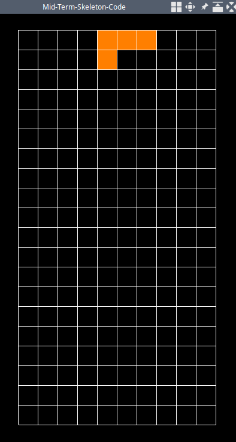

-   [OpenGL-SZU](#opengl-szu)
    -   [安装依赖项](#安装依赖项)
        -   [Linux](#linux)
        -   [Windows](#windows)
    -   [构建](#构建)
        -   [Linux](#linux-1)
        -   [Windows](#windows-1)
    -   [使用方法](#使用方法)
        -   [添加源文件](#添加源文件)
        -   [添加头文件](#添加头文件)
        -   [添加资源文件](#添加资源文件)

OpenGL-SZU
==========

为深圳大学计算机图形学的实验代码提供基于 CMake 的构建方案

安装依赖项
----------

### Linux

使用你的包管理器 (*apt, pacman, ...*) 安装如下的包

-   `freeglut` \>= 3
-   `glew` \>= 2
-   `cmake`

### Windows

1.  vcpkg

    1.  安装 `vcpkg` (具体请见 [vcpkg 的 github
        主页](https://github.com/microsoft/vcpkg))
    2.  `vcpkg install freeglut glew`
    3.  安装 `cmake` (具体请见 [CMake
        的官方页面](https://cmake.org/download/))

2.  MSYS2

    1.  安装 `MSYS2` (具体请见 [msys2
        的官方页面](https://www.msys2.org/))
    2.  `pacman -S mingw-w64-x86_64-freeglut mingw-w64-x86_64-glew cmake mingw-w64-x86_64-toolchain`

构建
----

欲知更多有关信息, 请参见 [CMake 官方网站](https://cmake.org),
[维基百科的构建自动化页面](https://en.wikipedia.org/wiki/Build_automation),
[维基百科的 CMake 页面](https://en.wikipedia.org/wiki/CMake)

### Linux

``` {.bash}
cd OpenGL-SZU
cmake -B build
cd build
make
```

### Windows

1.  Visual Studio

    1.  进入此仓库的根目录 `cd OpenGL-SZU`

    2.  `cmake -G "Visual Studio 14 2015 Win64" -B build`,

        这个命令会生成用于 VS2015 的工程文件, 如果要生成其他 VS
        版本的工程文件, 请参照 `cmake --help` 的输出结果中 *Generators*
        部分的内容, 对 `"Visual Studio 14 2015 Win64"` 进行相应修改

    3.  打开 `build/` 目录下的 `.sln` 文件

    如果使用 Visual Studio 2019, 则可以省略以上步骤, 直接打开此仓库.
    具体请见 [Visual Studio
    的这篇文档](https://docs.microsoft.com/en-us/cpp/build/cmake-projects-in-visual-studio?view=vs-2019)

2.  Visual Studio Code

    1.  在 VSCode 中, 安装插件:
        [C/C++](https://marketplace.visualstudio.com/items?itemName=ms-vscode.cpptools),
        [CMake
        Tools](https://marketplace.visualstudio.com/items?itemName=ms-vscode.cmake-tools)
    2.  在 VSCode 中打开此仓库
    3.  打开命令面板 (`Ctrl+Shift+P`), 运行 **CMake: Select a Kit**
        来选择你喜欢的构建方式
    4.  点击下方的状态栏里的 **build**

    具体请见 [Visual Studio Code
    的这篇官方教程](https://code.visualstudio.com/docs/cpp/cmake-linux)

3.  CLion

    1.  在 Clion 中, 选择 *File - Open*, 选择此仓库的根目录 (具体请见
        [此页面](https://www.jetbrains.com/help/clion/creating-new-project-from-scratch.html#open-prj))

使用方法
--------

-   此仓库默认的源文件可以经过编译得到一个[俄罗斯方块](https://en.wikipedia.org/wiki/Tetris)游戏,
    屏幕截图如下所示 
-   不限于默认的俄罗斯方块游戏，这里提供的代码也可以构建生成其它程序，只需要进行很小的修改，具体请见下方的说明
-   默认情况下, 生成的可执行文件会位于构建目录 (`build`) 下的 `bin`
    文件夹中

### 添加源文件

1.  将新的源文件放置在 `src` 文件夹下
2.  在 [CMakeList.txt](./CMakeLists.txt) 文件的 `# add source files`
    部分中添加对应的条目

比如你添加了 `src/camera.cpp` 文件, 那么新的 CMakeLists
文件中有关源文件的部分应当如下:

``` {.cmake}
# add source files
target_sources(main
  PRIVATE
    ${CMAKE_CURRENT_SOURCE_DIR}/src/main.cpp
    ${CMAKE_CURRENT_SOURCE_DIR}/src/Common/InitShader.cpp
    ${CMAKE_CURRENT_SOURCE_DIR}/src/camera.cpp)  # 新加入的源文件在这里
```

### 添加头文件

1.  将新的头文件放置在 `include` 文件夹下
2.  在源文件中正确地进行引用

比如你添加了 `include/camera.hpp` 这个头文件.
如果要在源代码中引用此文件, 使用语句 `#include <camera.hpp>`

### 添加资源文件

把你的资源文件 (例如 `.glsl`, `.jpg`) 放置在 `resource` 文件夹中,
所有位于 `resource` 文件夹中的文件都自动会被拷贝至可执行文件所在的目录
(`bin`) 中
